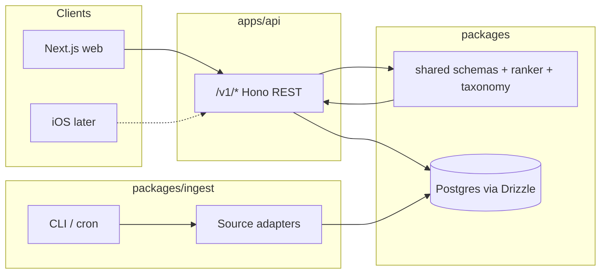
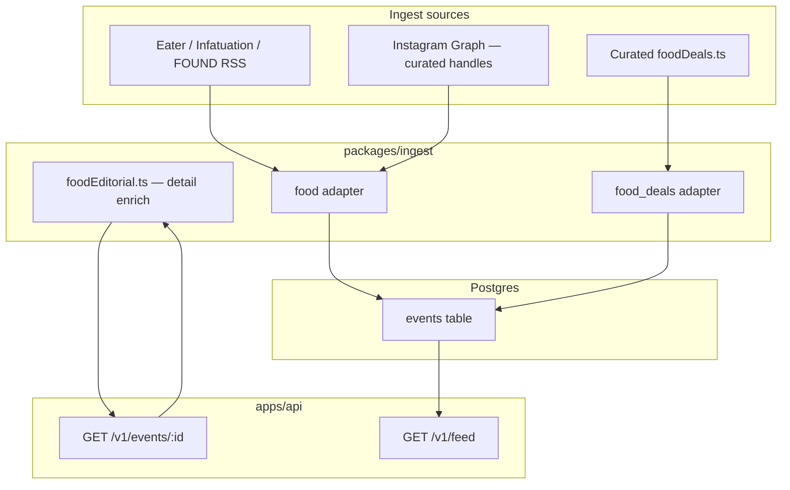

# Architecture

Bored is a **multi-city** events product (SF Bay Area + Chicago today) with an **API-first** backend so a future iOS client can share the same server.

## Goals

- Aggregate events and showtimes from many sources into one ranked feed per metro
- Personalize by interests while still surfacing adjacent + serendipitous picks
- Keep ingest pluggable: new source or city = new adapter (or city config), same normalize path
- Ship feed quality first in the launch metro; expand cities by filling vertical gaps, not by forking the stack
- Schema is multi-user from day one

## High-level diagram



## Monorepo layout

```
apps/
  web/          Next.js App Router UI (mobile-first)
  api/          Hono REST API on Node
packages/
  shared/       Zod schemas, taxonomy, ranker, curated food/activity config (no I/O)
  db/           Drizzle schema, migrate, seed
  ingest/       SourceAdapter implementations + runner
drizzle/        Generated SQL migrations (when using generate)
docs/           Architecture and operational docs
```

### Package boundaries

| Package | May depend on | Must not |
|---|---|---|
| `@bored/shared` | zod only | db, fetch, Next, Hono |
| `@bored/db` | shared, drizzle, postgres | Next, adapters |
| `@bored/ingest` | shared, db | Next UI |
| `@bored/api` | shared, db | adapter fetch logic |
| `@bored/web` | shared (types), HTTP to API | db, ingest |

**Rule:** the API never scrapes. Ingest writes normalized rows; the API only reads/ranks/signals.

## Multi-city model

Cities are a **product surface**, not separate apps. One Postgres, one API, one ranker — metro differences live in taxonomy config, adapter coverage, and seed data.

### City / area selectors

| Concept | Where | Notes |
|---|---|---|
| `FeedCity` | `taxonomy.ts` | Top-level metro: `sf` \| `chicago` |
| `FeedArea` | `taxonomy.ts` | Geographic filter passed to API: `sf` \| `bay` \| `chicago` |
| `SF_DEFAULT` / `CHI_DEFAULT` | `taxonomy.ts` | Lat/lng, zip, timezone, default radius |
| `eventInArea()` | `taxonomy.ts` | Keeps metros isolated — Chicago rows never leak into Bay feeds |
| `feedFilterSourcesForCity()` | `taxonomy.ts` | Per-metro source chips on home feed |
| `FEED_TOPICS` / `matchesFeedTopic()` | `taxonomy.ts` | Activity-type chips (concerts, happy hours, …) — independent of ingest source |
| `NEIGHBORHOODS` / `CHI_NEIGHBORHOODS` | `taxonomy.ts` | Per-metro tastes chips via `neighborhoodsForCity(city)` |

SF has two area scopes (`sf` = city proper, `bay` = full metro). Chicago uses a single `chicago` area today.

### Adapter patterns

Three patterns cover all current sources:

1. **Shared source, city-parametric adapter** — one `source` value, separate adapter ids per metro when geo/config differs:
   - `19hz` / `19hz_chi`, `luma` / `luma_chi`, `ticketmaster` / `ticketmaster_chi`, `ra_sf` / `ra_chi`, `eventbrite` / `eventbrite_chi`
   - Factory helpers (e.g. `createTicketmasterAdapter({ geo, adapterId })`) avoid duplicating fetch logic

2. **City-native local calendar** — no shared parent source; Funcheap ↔ Do312 ↔ Chicago on the Cheap analogs:
   - SF: `funcheap`, `newsletter`, `partiful`
   - CHI: `do312`, `chicago_cheap`

3. **Metro-specific vertical** — city-scoped config or parallel adapter ids; SF is deepest today:
   - **Both metros:** food tips (`food` + `FOOD_METRO_CONFIGS`), food deals (`food_deals`), comedy recurring + `comedy_venue` / `comedy_venue_chi`, activities (`activities`)
   - **SF only (for now):** `instagram`, `newsletter`, `partiful`, `openmic_agg`, `indie_theater`, `movies_tms`

Every normalized row must set `city` (canonical slug via `cityKeyFromLabel`) so area filters work.

## Vertical coverage (current)

| Vertical | SF / Bay | Chicago | Implementation notes |
|---|---|---|---|
| Electronic / dance | ✅ `19hz`, `ra_sf` | ✅ `19hz_chi`, `ra_chi` | `music.electronic` + genre tags → **Concerts** topic |
| Free / cheap | ✅ `funcheap` | ✅ `chicago_cheap` | `free` category + `categoriesFromText` heuristics |
| Tech / meetups | ✅ `luma` | ✅ `luma_chi` | `tech` category — **not** Concerts (Luma ≠ music) |
| Concerts / sports / theater | ✅ `ticketmaster` | ✅ `ticketmaster_chi` | Genre-aware TM mapping → `music.*`; sports tag |
| General discovery | ✅ `eventbrite` | ✅ `eventbrite_chi` | `mapEbCategories()` |
| Local nightlife calendar | ✅ `partiful` | ❌ | Best-effort explore |
| Comedy — ticketed clubs | ✅ `comedy_venue` (Cobb's, Punch Line via TM) | ✅ `comedy_venue_chi` (Zanies, Laugh Factory, …) | Force `comedy.club` → **Comedy** topic |
| Comedy — recurring rooms | ✅ `recurring` + `recurring_shows` seed | ✅ `recurring` + CHI seed | Comedy subtypes on every row |
| Comedy — open mic proposals | ✅ `openmic_agg` | ❌ | Inactive proposals until curated |
| **Food — evergreen tips** | ✅ `food`, `instagram` | ✅ `food` | `food` category → **Food & drink** topic |
| **Food — happy hour / lunch** | ✅ `food_deals` | ✅ `food_deals` | **Happy hours** topic (`dealKind`) |
| **Activities — evergreen** | ✅ `activities` | ✅ `activities` | `outdoors` / `arts` → Arts & culture topic |
| Movies / showtimes | ✅ `movies_tms`, `indie_theater` (Roxie) | ❌ | **Movies** topic = showtime cards (SF only until TMS CHI) |
| Newsletters | ✅ `newsletter` | ❌ | Broke-Ass / Eddie's List RSS |

Topic filter contract for all rows: [ingest.md — Category mapping](./ingest.md#category-mapping-for-topic-filters). Chicago backfill: [city-seeding.md — Topic filter categorization](./city-seeding.md#topic-filter-categorization-every-metro).

See [City seeding plan](./city-seeding.md) for closing Chicago gaps. Evergreen activities (parks, hikes, local gems) are a cross-metro requirement — see [City expansion strategy](./city-expansion-strategy.md).

## Food vertical (multi-city reference)

Food is **not** timed ticketing — it is editorial recommendations surfaced in the feed like events. SF and Chicago share the same adapters; metro differences live in shared config (`FOOD_METRO_CONFIGS`, `CURATED_FOOD_DEALS_*`).



**Evergreen tips** (`food`, `instagram`):

- Per-metro RSS/outlets in `packages/shared/src/foodCityConfig.ts` (SF: Eater, Infatuation, FOUND; CHI: Eater, Infatuation)
- Sources are reviews, maps, hit lists — not calendar listings
- `startsAt` is a stable near-term dinner slot (`suggestionStartsAt`) so tips appear in today/weekend windows
- UI labels them as recommendations, not timed events
- Detail pages lazy-enrich from source URL via `foodEditorial.ts` (+ Google Places photo fallback)

**Scheduled deals** (`food_deals`):

- Curated happy hours / lunch specials in `packages/shared/src/foodDeals.ts` (`CURATED_FOOD_DEALS_SF`, `CURATED_FOOD_DEALS_CHICAGO`)
- One durable row per deal with `rawPayload.schedule`; `startsAt` is the next occurrence
- Feed expands matching weekdays into today / weekend / Select Date windows (`expandFoodDealRowsForFeed`)
- Feed `food` filter chip also matches `food_deals` rows; **Happy hours** topic matches `food_deals` where `dealKind !== "lunch"`

Replicating food in a new city = new RSS/outlet URLs + curated deals list + optional IG handles — same adapters with city config, not a new vertical.

## Comedy vertical (multi-city reference)

Three layers stack (SF + Chicago where seeded):

1. **Ticketed headliners** — `comedy_venue` / `comedy_venue_chi` adapters (Ticketmaster keyword search; rows use `source=comedy_venue`)
2. **Recurring rooms** — `recurring_shows` seed table (includes `city` slug) → `recurring` adapter materializes **one durable event per active show** (schedule in `rawPayload`; feed expands weekdays). Comedy subtypes: `comedy.club`, `comedy.showcase`, `comedy.open_mic`, `comedy.underground`
3. **Discovery proposals** — `openmic_agg` scrapes SF standup directories (SF only today); rows land as inactive `recurring_shows` until approved

Ranking treats comedy subtypes as adjacent (club ↔ showcase ↔ underground).

## Runtime flow

### Read path (feed)

1. Web calls `GET /v1/feed?mode=&area=&topics=&sources=` (optional `date=YYYY-MM-DD`)
2. API loads user prefs + signals from Postgres
3. API loads `events` (+ film showtimes) in the time window — for a selected calendar day, the full local day (metro TZ)
4. Filters by **area** (`sf` | `bay` | `chicago`) via `eventInArea`
5. Optional hard filters: **topics** (activity type), **sources** (adapter), **categories** (interest ids), `freeOnly`
6. When area is Chicago, recenters ranking geo on `CHI_DEFAULT` and widens radius
7. `@bored/shared` `rankFeed` scores and buckets cards (chronological for `mode=all` / day browse; prefer live+upcoming when truncating)
8. Client renders cards; on **Today**, collapses finished (non-live) rows behind “View earlier”; live rows show a **Now** pulse

### Write path (tastes / signals)

1. Onboarding → `PUT /v1/me/interests` (interest weights, neighborhoods, budget)
2. Save / Skip / Going → `POST /v1/me/signals`
3. Next feed request re-ranks using prefs + dismissals/saves

### Ingest path

1. `pnpm ingest:once` / scheduled CLI runs adapters
2. Each adapter returns `NormalizedEvent[]` and/or showtime batches
3. Runner upserts into `events` / `films` / `theaters` / `showtimes`
4. Run metadata lands in `ingest_runs`

Phase 1 adapters run on a 6h schedule; Phase 2 (food, comedy depth, movies enrich) on daily runs. See [Ingest](./ingest.md).

## Auth model (v1)

- No full auth product yet
- Clients send `X-User-Id` (demo UUID in `.env`)
- Schema already has `users` + `user_profiles` for multi-user

## Feed product surface

Home is one composition per metro, not a source dashboard:

- **City:** San Francisco | Chicago
- **Area:** All SF | All Bay Area | Chicago
- **Mode:** For you | Today | Weekend | Select Date
- **Day strip:** under Weekend (Fri–Sat–Sun highlighted) and Select Date (All days + calendar); selecting a day passes `?date=YYYY-MM-DD`
- **Today:** full local calendar day; live + upcoming first; subtle “View N earlier” expands finished events; **Now** badge while an event is in progress
- **By time:** layout icon (chrono day-grouped list), not a mode chip
- **Topic chips:** activity filters (Concerts, Comedy, Free, Happy hours, Street festivals, …) — `FEED_TOPICS`, not tied to adapter
- **Source chips:** metro-specific subset of adapters (secondary to topics)
- **Tastes:** onboarding interest weights — personalize ranking, not a hard feed filter
- Event detail + film detail in a right-edge drawer with Luma-style animated mesh background (colors from event type); trailers, RT/Letterboxd reviews, and outbound tickets / review deep-links
- Food cards show recommendation framing; food deals show weekday/time windows

## Timezones, live & earlier today

Two timezone concepts — do not conflate them:

| Concept | Source | Used for |
|---|---|---|
| **Metro TZ** | `SF_DEFAULT` / `CHI_DEFAULT` (`America/Los_Angeles` / `America/Chicago`) | Day strip, `?date=` calendar bounds (`calendarDayBounds`), feed list formatting |
| **Event TZ** | `events.timezone` (set at ingest) | Detail page wall-clock labels; usually matches the metro |

**Storage:** `startsAt` / `endsAt` are UTC (`timestamptz`). Ingest parses source wall clocks into those instants.

**Live / happening now:** compare UTC instants — `Date.now()` vs `[startsAt, endsAt)` via `isHappeningNow()` in `packages/shared/src/datetime.ts`. Metro TZ is **not** needed for the live check (an SF 7pm start and a Chicago 7pm start are already different UTC values). If `endsAt` is missing, assume **3 hours** (`DEFAULT_EVENT_DURATION_MS`).

**Earlier today (web):** when browsing Today, the API returns the full local day. The client (`ByTimeFeed` + `collapseEarlier`) hides finished non-live rows behind “View earlier” / “Hide earlier”. Live events stay in the main list with `LiveNowBadge`.

Helpers: `dayKey`, `calendarDayBounds`, `fromZonedTime`, `isHappeningNow`, `isEarlierEvent` — `@bored/shared`.

## Design constraints

- API contract is the product boundary for iOS later
- Ranking lives in `shared` so it can be unit-tested without HTTP
- Adapters are interchangeable (`SourceAdapter { id, fetch() }`)
- Prefer official APIs / public feeds; scrape only where necessary and fail soft without keys
- New cities extend config + adapters; do not fork API, schema, or ranker
- Never mix metros in a feed — `eventInArea` is the hard gate

## Related docs

- [API reference](./api.md)
- [Ingest sources](./ingest.md)
- [City seeding plan](./city-seeding.md)
- [City expansion strategy](./city-expansion-strategy.md)
- [Ranking](./ranking.md)
- [Data model](./data-model.md)
