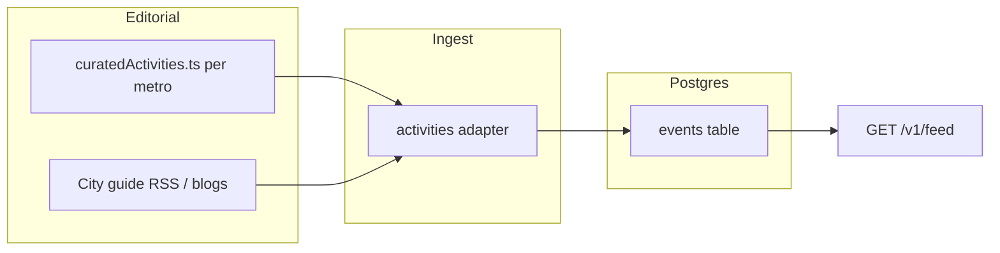

# City expansion strategy

Cross-cutting playbook for what **every metro** should ship beyond timed event calendars. SF is the reference; Chicago is the first expansion target. See [City seeding plan](./city-seeding.md) for metro-specific phases and adapter checklists.

## Why evergreen activities

Calendar ingest (Ticketmaster, Luma, Do312, …) fills the feed with **dated listings**. That alone feels generic — the same concerts and ticketed shows any aggregator has.

Evergreen activities are **durable “things to do”** you’d find in a city guidebook, local blog, or “best of” list:

- Hikes and trailheads
- Green spaces and parks (hang-out spots, not just event venues)
- Signature walks and viewpoints (“walk Golden Gate Park end to end”)
- Recurring local pastimes — arcade bars, thrift districts, food-truck yards, driving ranges, axe throwing, mini-golf, mural routes

They are **not tied to a showtime**. Like food tips, they answer: *“What should I do this afternoon?”* without requiring a ticket drop.

## Two layers: iconic vs local gems

Every city seed should explicitly cover **both** layers. Tag or bucket curated rows so ranking and UI can surface the right vibe.

| Layer | What it is | User intent | Examples |
|---|---|---|---|
| **Iconic / visitor** | Postcard stuff — guidebooks, “top 10”, first-time SF/CHI | “I’m here for the weekend; hit the highlights” | Walk Golden Gate Park · Alamo Square · Lincoln Park Zoo · Navy Pier · Millennium Park |
| **Local gems** | Places regulars love but many locals still haven’t tried | “I’ve lived here 5 years — what did I miss?” | Emporium / Detour arcade bars · Wasteland thrift · Spark Social (food trucks + mini-golf) · Presidio driving range · downtown CHI mini-golf · graffiti mural routes · axe throwing in GG Park |

**Product goal:** A feed that feels like a well-read friend, not a tourism board. Iconic rows establish credibility; local-gem rows drive saves and “I had no idea” moments.

### Heuristics for classification

| Signal | Likely **iconic** | Likely **local gem** |
|---|---|---|
| Source | Time Out / Eater “best of”, official park pages, guidebook lists | Reddit threads, local Substacks, friend recommendations, niche blogs |
| Search volume | High generic queries (“things to do in SF”) | Long-tail (“arcade bar SF”, “mini golf downtown Chicago”) |
| Venue type | Landmark parks, famous viewpoints, major museums | Specialty retail, hybrid yards (food + games), neighborhood murals |
| Repeat visit | Worth doing once as a visitor | Worth doing monthly as a local |

When in doubt, **prefer local gems** — iconic stuff is already over-represented in generic feeds.

## Activity categories (seed every city)

Use this checklist when curating a new metro. Aim for **≥3 rows per category** where the city has real options; skip categories that don’t apply.

| Category | `categories` / tags | Topic chip(s) | Notes |
|---|---|---|---|
| **Hikes & trails** | `outdoors` | Arts & culture (partial), tastes | Named trailheads, loop hikes, urban stairways, waterfront paths |
| **Parks & green space** | `outdoors`, `free` | Free, Arts & culture | Day-hang parks (Dolores, Humboldt, Lincoln Park), not just event lawns |
| **Signature walks** | `outdoors`, `arts` | Arts & culture | End-to-end park walks, waterfront promenades, neighborhood strolls |
| **Hidden play** | `outdoors`, `family`, `nightlife` | — | Mini-golf, driving ranges, axe throwing, bowling, arcade bars, batting cages |
| **Shopping & browse** | `arts`, `free` | Arts & culture, Free | Thrift/vintage corridors, flea markets, record stores, maker markets |
| **Food yards & trucks** | `food`, `outdoors` | Food & drink | Permanent food-truck parks, night markets (evergreen locations, not one-off festivals) |
| **Street art & murals** | `arts`, `free` | Arts & culture, Free | Self-guided mural routes, legal walls, district clusters |
| **Viewpoints & photo spots** | `outdoors`, `free` | Free, Arts & culture | Hills, piers, rooftops (public access only) |

Categories map to `INTEREST_CATEGORIES` in `taxonomy.ts` and to **feed topic chips** via `matchesFeedTopic()` — see [Category mapping for topic filters](./ingest.md#category-mapping-for-topic-filters).

## Reference seeds

### San Francisco / Bay

| Layer | Examples |
|---|---|
| Iconic | Golden Gate Park (full walk) · Dolores Park · Crissy Field · Lands End · Ferry Building waterfront |
| Local gems | **Arcade bars:** Emporium, Detour · **Thrift:** Wasteland (Haight), Community Thrift · **Food yards:** Spark Social (SoMa — trucks + mini-golf) · **Driving range:** Presidio Golf Course practice area · **Axe throwing:** Bad Axe Throwing / park-adjacent pop-ups · **Murals:** Clarion Alley, Balmy Alley, Mission District routes |

### Chicago

| Layer | Examples |
|---|---|
| Iconic | Millennium Park · Lakefront Trail · Lincoln Park · Navy Pier (iconic even if touristy) · 606 trail |
| Local gems | **Mini-golf downtown** (locals often don’t know it exists) · **Arcade / bar games** · **Thrift:** Unique, Village Discount, cross-neighborhood vintage corridors · **Food yards:** Politan Row, Logan Square farmers market adjacency · **Murals:** Pilsen, Wabash Arts corridor |

Use these tables as **editorial targets**, not exhaustive lists. Each new city gets its own curated file (see implementation below).

## Implementation model

Follow the **food tips vertical** pattern — same tables, same feed UX, curated + lightly scraped sources.



### Data shape

- **Source:** `activities` (new) or extend `food`-style editorial adapter
- **`city`:** canonical slug (`sf`, `chicago`, …)
- **`startsAt`:** stable suggestion slot (same as food tips — `suggestionStartsAt`, not a real reservation time)
- **`categories` / `tags`:** `outdoors`, `arts`, etc. + **`audience:iconic` | `audience:local_gem`** (tag or `rawPayload`)
- **No invented showtimes** — these are recommendations, not ticketed events

### Suggested curated schema

```ts
type CuratedActivity = {
  city: string;
  title: string;
  description: string;
  venueName?: string;
  neighborhood?: string;
  lat?: number;
  lng?: number;
  url?: string;
  audience: "iconic" | "local_gem";
  activityKind:
    | "hike"
    | "park"
    | "walk"
    | "play"
    | "shop"
    | "food_yard"
    | "murals"
    | "viewpoint";
  categories: string[];
  tags?: string[];
};
```

Store per-metro lists in `packages/shared/src/curatedActivities.ts` (or split `curatedActivities.sf.ts` / `.chi.ts` as lists grow).

### Source ideas (ingest, not just manual seed)

| Source type | Examples | Use for |
|---|---|---|
| City guide RSS | Time Out, Eater “best things to do”, local magazine hubs | Iconic + seasonal refreshes |
| Park districts | SF Rec & Park, Chicago Park District | Trails, facilities, hours |
| Hiking / outdoors blogs | Local trail write-ups, AllTrails editorial (link-out) | Hikes, loops |
| Local Substacks / reddit wiki | “Hidden gems”, “underrated” threads | Local-gem discovery |
| Existing newsletter adapter | Broke-Ass Stuart, Eddie's List *guides* (not weekly roundups) | Extraction candidates — see [ingest.md](./ingest.md) |

**Do not** ingest weekly “events this weekend” roundups as single evergreen rows — same rule as newsletter adapter.

### Feed & ranking

- Surface under **Outdoors** / **Arts & culture** topic chips and interest weights (`outdoors`, `arts`)
- Balance iconic vs local_gem in ranking: boost local gems for users with `onboardingComplete` and repeat opens; keep a few iconic anchors for new users
- Label in UI: **“Recommendation”** (like food tips), optionally sub-label **“Local gem”** vs **“Classic”**

## Every-city checklist

Add these steps to the [adapter refactor checklist](./city-seeding.md#adapter-refactor-checklist-reusable-for-any-new-city):

| Step | Action |
|---|---|
| A1 | Draft **≥20 curated activities** — at least 40% `local_gem`, cover ≥5 activity categories |
| A2 | Add metro block to `curatedActivities.ts` (or city config) |
| A3 | Wire **`activities` adapter** (materialize curated rows + optional guide RSS) |
| A4 | Set `city`, geo, neighborhood on every row; smoke-test `area=` isolation |
| A5 | Verify feed shows recommendations alongside food tips; no fake times in detail |
| A6 | Set `categories[]` on every activity row (`outdoors`, `arts`, `food`, …) for topic chips — [ingest contract](./ingest.md#category-mapping-for-topic-filters) |
| A7 | Document iconic vs local split in PR / seed notes for future editors |
| A8 | Ship **metro neighborhood chips** (`N_NEIGHBORHOODS` + `neighborhoodsForCity`) — [Tastes / neighborhoods](#tastes--neighborhoods-onboarding) |

**Acceptance:** ≥15 evergreen activity cards per metro, both audience layers represented, detail page enriches from source URL when available.

## Tastes / neighborhoods (onboarding)

Neighborhood chips on **Edit tastes** must be **metro-specific**. SF Mission pills must never appear while the user’s active feed city is Chicago (and vice versa).

| Piece | Where | Guidance |
|---|---|---|
| **SF / Bay list** | `taxonomy.ts` → `NEIGHBORHOODS` | City + East Bay / Peninsula chips used for SF tastes |
| **Chicago list** | `taxonomy.ts` → `CHI_NEIGHBORHOODS` | Align labels with ingest (`food.ts`, Do312, curated activities) — e.g. Wicker Park, Logan Square, West Loop, The Loop, Pilsen |
| **Resolver** | `neighborhoodsForCity(city)` | Single entry point for web + API |
| **Defaults** | `defaultNeighborhoodsForCity(city)` | Empty-profile defaults (not hard-coded Mission/North Beach) |
| **UI** | `apps/web/src/app/onboarding/page.tsx` | Resolve city from `readFeedPrefs()` / `metroFromArea`; filter saved prefs to the active metro’s list; save `lat`/`lng`/`radiusMiles` from that metro’s `*_DEFAULT` |
| **API** | `GET /v1/meta/taxonomy` → `neighborhoodsByCity` | Flat `neighborhoods` remains SF-only for legacy; prefer `neighborhoodsByCity` |

When adding city **N**:

1. Add `N_NEIGHBORHOODS` (≈12–20 chips locals actually choose)
2. Extend `neighborhoodsForCity` / `defaultNeighborhoodsForCity`
3. Add `neighborhoodsByCity.n` on taxonomy meta
4. Keep chip names in sync with adapter `neighborhood` strings so ranking prefs match rows

**Acceptance:** With feed city = Chicago, `/onboarding` shows only Chicago neighborhoods and saving recenters ranking geo on `CHI_DEFAULT`.

## City hero (web)

Every metro needs a **place-specific feed hero** — not a generic “what’s on” blurb that could sit on any aggregator.

| Piece | Where | Guidance |
|---|---|---|
| **Cover photo** | `apps/web/src/lib/city-heroes.ts` → `CITY_HERO_IMAGES` | Unsplash (or similar) dusk/night skyline that takes a saturated color wash; credit + permalink stored |
| **Party palette** | `CITY_HERO_PALETTES` | 4 hot colors (magenta / coral / amber / cyan family) for canvas orbs + sparks |
| **Hero lede** | `cityHeroLede()` | ≤~110 chars; local friend voice; name neighborhoods, rooms, or metro-specific cues — **never** “music, comedy, and the odd gem…” |
| **Title** | `cityHeroTitle()` | `FEED_CITY_LABELS` or area override (e.g. Bay Area) |
| **Loading phrase** | City feed page | Metro-flavored “Gathering the …” (fog / wind / …) — see [city-seeding checklist](./city-seeding.md#adapter-refactor-checklist-reusable-for-any-new-city) |

**UI contract:** full-bleed cover (viewport edge-to-edge), Partiful-adjacent color energy (canvas FX + hot gradient veil) instead of a calm soft blur. Respect `prefers-reduced-motion` (static orbs, no spark rain).

### Current copy

| Metro / area | Lede |
|---|---|
| San Francisco | Foghorn nights, Mission dance floors, and comedy that runs late. |
| Bay Area | East Bay warehouses, Peninsula stages, and everything between the bridges. |
| Chicago | Lakefront golden hour, warehouse bass, and rooms that laugh all week. |

When adding city **N**, ship hero image + palette + lede in the same PR as the web city selector.

### SF status — shipped ✅

- `CURATED_ACTIVITIES_SF` — 34 rows (13 iconic, 21 local gems)
- `activities` adapter wired in ingest runner
- Feed/detail UI: untimed tips with `Classic · …` / `Local gem · …` labels
- City hero: Unsplash cover + party FX + SF / Bay ledes

### Chicago status — shipped ✅

- `CURATED_ACTIVITIES_CHI` — 35 rows (10 iconic, 25 local gems)
- City-aware timezone (`America/Chicago`) in `activities` adapter
- **Things to do** topic chip (`topics=activities`) — not a source chip
- Includes Pilsen murals, Puttery mini-golf, Emporium/Replay arcade bars, Politan Row, Diversey range, and lakefront/park loops
- City hero: Unsplash cover + party FX + Chicago lede

## Priority vs other verticals

| Priority | Vertical | Rationale |
|---|---|---|
| P0 | Phase 1 calendars + food tips | Minimum viable metro ([city-seeding](./city-seeding.md)) |
| **P1** | **Evergreen activities** | High taste signal, differentiates from Ticketmaster-only feeds; reuses food-style UX |
| P1 | Food deals, comedy depth | Engagement loops for repeat users |
| P2 | Movies, Instagram | Depth |

Ship **food tips + evergreen activities** before calling a city “launch-ready” for taste-driven users.

## Related docs

- [City seeding plan](./city-seeding.md) — Chicago phases, adapter checklist
- [Architecture — food vertical](./architecture.md#food-vertical-sf-reference-implementation) — evergreen recommendation pattern to copy
- [Ingest — newsletter / guides](./ingest.md) — what to extract vs skip
